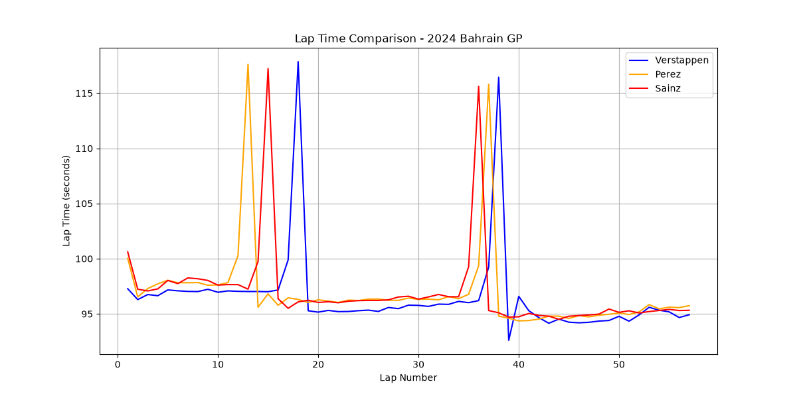

# F1 Pit Stop Strategy Analysis — 2024 Bahrain Grand Prix

A Python project that uses real Formula 1 telemetry data to visualize lap 
times and reveal pit stop strategy for the 2024 Bahrain Grand Prix podium 
finishers: Max Verstappen, Sergio Perez, and Carlos Sainz.

## What it does

This script pulls official lap-by-lap timing data for the race and plots 
each driver's lap time across the full Grand Prix. Pit stops are clearly 
visible as sharp spikes in lap time, since a driver's lap slows dramatically 
while they're in the pit lane. The chart reveals each driver's pit stop 
timing, strategy (a two-stop race for all three drivers), and overall pace.

## Tech stack

- **Python**
- **[FastF1](https://github.com/theOehrly/Fast-F1)** — official F1 timing 
  and telemetry data
- **pandas** — organizing and processing lap data
- **matplotlib** — visualization

## How to run it

1. Clone this repository
2. Install dependencies: `pip3 install fastf1 pandas matplotlib`
3. Run: `python3 f1_analysis.py`
4. The script will cache race data locally and generate `lap_comparison.png`

## What I learned

Early on, I was working from lap data for the wrong drivers and caught the 
mistake by checking it against the actual 2024 Bahrain GP results, then 
corrected it to the real podium finishers. I also set up Git and GitHub for 
the first time on this project, including resolving a merge conflict 
between my local repository and GitHub's auto-generated README.

## What's next

I'm expanding this into an interactive Streamlit dashboard that lets a 
user select any driver and any set of races to analyze lap time trends, 
tire compound performance, and circuit-type comparisons.
